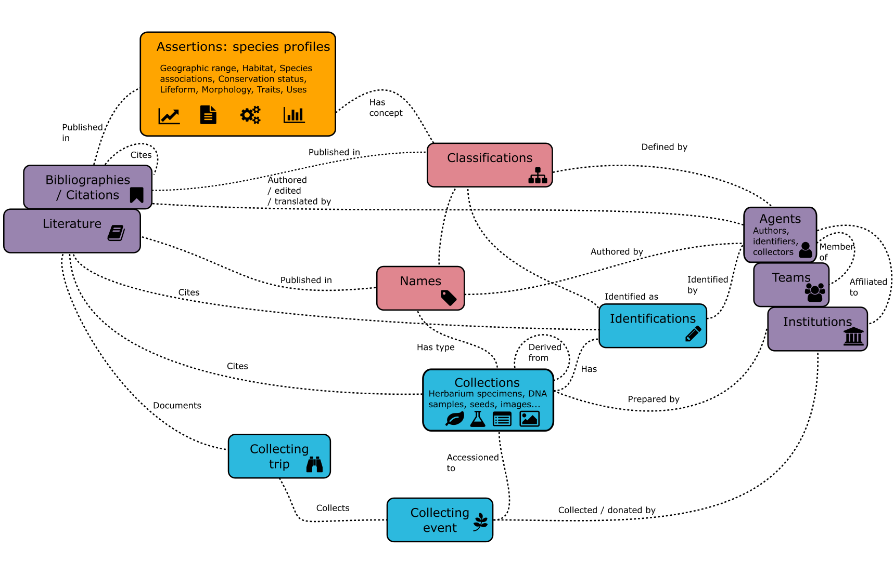

*KewBridge* is an effort to prioritise, build and document datasets which can be used to train machine learning applications. 

Scoping and prioritising this work is likely to involve quite a bit of discussion: we will try to do this in the open using the [discussions](https://github.com/orgs/KewBridge/discussions) feature.

## Background

### Digitisation project

TBC

### How the data fit together

## Timeline

- July 2023 First student placement (8 weeks)
- August 2023 [Imageomics workshop](https://imageomics.osu.edu/image-datapalooza-2023)
- September 2023 Second student placement (12 months)

## Sub-projects

TBC

## Contributing

TBC

## Contact
- Nicky Nicolson (n.nicolson@kew.org)
